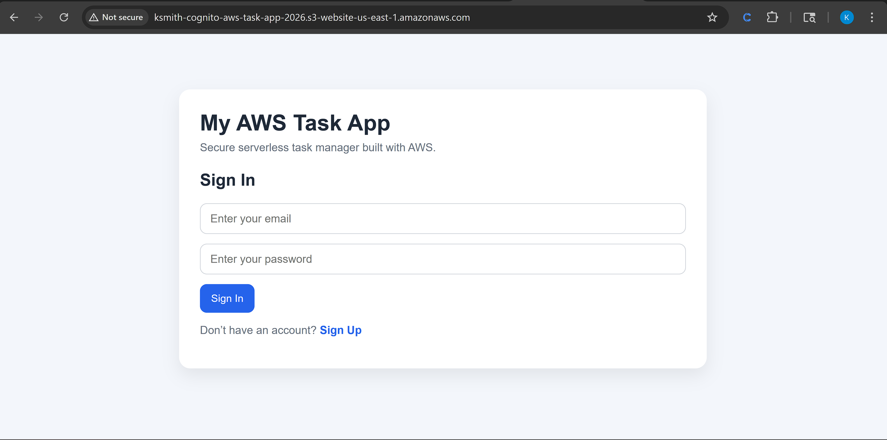
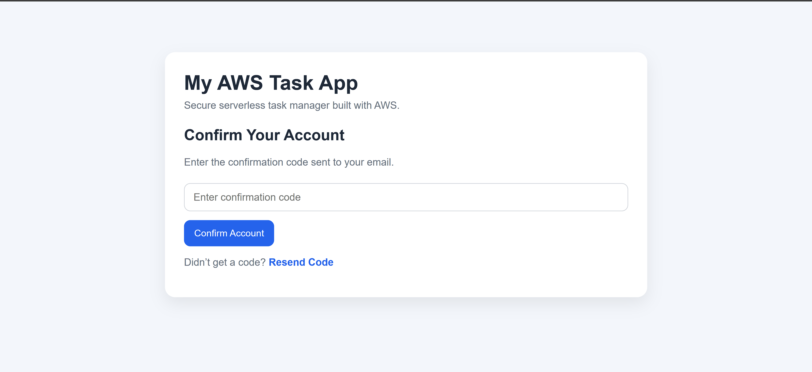
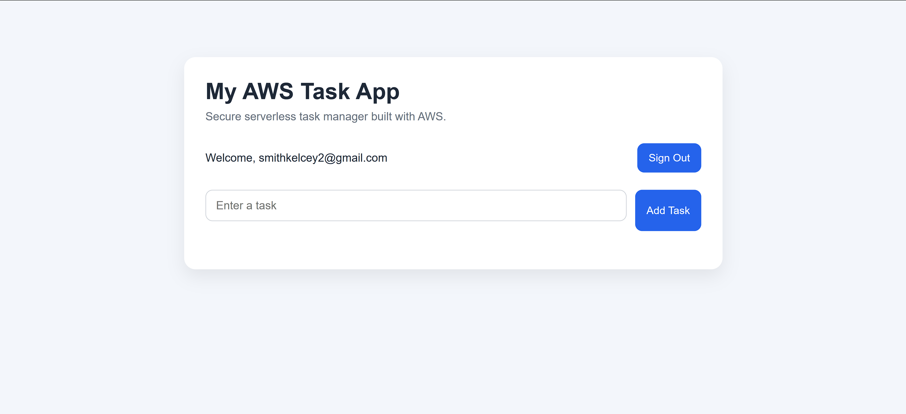

# AWS Cognito Task App (Authentication Version)

## Overview
This project is a serverless web application that implements user authentication using Amazon Cognito.

It includes a custom frontend built with HTML, CSS, and JavaScript, and demonstrates how to handle user sign-up, confirmation, and sign-in without relying on a traditional backend authentication system.

## Features
- User sign-up with email and password
- Email-based account confirmation
- User sign-in and sign-out
- Dynamic UI switching between authentication and application views
- Session persistence using localStorage

## Technologies Used
- Amazon Cognito
- HTML
- CSS
- JavaScript
- AWS S3 (static website hosting)

## Architecture
Frontend (S3 Hosted Website)
        ↓
Amazon Cognito (User Authentication)

## How It Works
1. Users create an account using email and password
2. Cognito sends a confirmation code via email
3. Users confirm their account using the code
4. Users sign in and access the application interface
5. Session state is managed on the frontend

## Future Improvements
- Connect authentication to backend API
- Store user-specific tasks in DynamoDB
- Secure API Gateway with Cognito authorizer
- Improve UI/UX design

## Screenshots

### Login Screen

### Confirmation Screen

### Dashboard

## Live Demo
http://ksmith-cognito-aws-task-app-2026.s3-website-us-east-1.amazonaws.com
